# 📦 Projeto: Infraestrutura AWS com CDK, ECS, RDS, Puppet e FastAPI

Este projeto provisiona uma infraestrutura completa na AWS utilizando AWS CDK (Python), integrando:

- VPC com subnets públicas e privadas
- EC2 Bastion Host com Puppet
- RDS Aurora PostgreSQL Serverless v2
- ECS Fargate
- ECR
- Application Load Balancer
- Aplicação FastAPI
- Pipeline CI/CD com GitHub Actions

## 🗺️ Arquitetura

```mermaid
flowchart TB
    User[Usuário / Internet] --> ALB[Application Load Balancer :80]

    subgraph AWS
        subgraph VPC
            subgraph PublicSubnet
                ALB
            end

            subgraph PrivateSubnet
                ECS[ECS Fargate Service]
                Bastion[Bastion Host EC2]
                RDS[(Aurora PostgreSQL)]
            end
        end

        S3[S3 Puppet Bucket]
        ECR[ECR Repository]
        Secrets[Secrets Manager]
    end

    ALB --> ECS
    ECS --> RDS

    ECS --> Secrets
    Bastion --> RDS
    Bastion --> S3

    ECS --> ECR
```



## 🧱 Componentes da Infraestrutura

### 🪣 S3 (Puppet Bucket)

Bucket responsável por armazenar os manifests e módulos Puppet.

**Função:**

- Centralizar os arquivos de configuração
- Permitir que o Bastion Host sincronize os manifests automaticamente

### 🌐 VPC

- 2 AZs
- Subnets:
  - Públicas (ALB)
  - Privadas com NAT (ECS, RDS, Bastion)

### 🖥️ Bastion Host (EC2)

Instância EC2 privada usada para:

- Acesso administrativo via AWS SSM
- Execução do Puppet

**Funções:**

- Instala o Puppet
- Sincroniza arquivos do S3
- Aplica os manifests automaticamente no boot

**Trecho executado:**

```
aws s3 sync s3://<bucket>/puppet /opt/puppet
puppet apply puppet/manifests/site.pp
```

### 🗄️ RDS Aurora PostgreSQL Serverless v2

Banco de dados relacional:

- Engine: Aurora PostgreSQL 14
- Serverless (auto scaling)
- Acesso permitido apenas:
  - Bastion Host
  - ECS
- Credenciais:
  - Geradas automaticamente pelo Secrets Manager

### 🐳 ECR (Elastic Container Registry)

Repositório para armazenar a imagem Docker da aplicação FastAPI.

### 🚀 ECS Fargate

Executa a aplicação FastAPI como container.

**Configuração:**

- Task Definition
- Variáveis de ambiente:
  - DB_NAME
  - DB_HOST
- Secrets:
  - DB_USER
  - DB_PASSWORD

### ⚖️ Application Load Balancer (ALB)

- Porta: 80
- Roteia requisições para ECS
- Health check: `/health`

## 🧩 Aplicação FastAPI

**Local:** `app_fastapi/`

**Função:**

- API REST
- Conectada ao banco PostgreSQL
- Exposta via ALB

**Exemplo de endpoint:**

- GET `/health`

## 🧙 Puppet

**Estrutura:**

```
puppet/
├── manifests
│   └── site.pp
└── modules
    ├── users
    └── phpmyadmin
```

**Funções:**

- Criação de usuários
- Instalação de pacotes
- Configuração automática da instância
- Aplicado automaticamente no Bastion Host.

## ⚙️ GitHub Actions (Workflow)

Pipeline responsável por:

- Autenticar na AWS via OIDC
- Instalar dependências
- Executar: `cdk deploy --require-approval never`

**Disparos:**

- Push na branch main
- Manual (workflow_dispatch)

## ▶️ Como executar

1. **Instalar dependências**

   ```
   pip install -r requirements.txt
   npm install -g aws-cdk
   ```

2. **Bootstrap do CDK**

   ```
   cdk bootstrap
   ```

3. **Deploy da infra**
   ```
   cdk deploy
   ```

## 📤 Outputs

Ao final do deploy:

- URL pública da aplicação
- ID da instância Bastion
- Endpoint do banco
- ARN do Secret
- Nome do bucket Puppet

## 🔐 Boas práticas implementadas

- ✔️ Subnets privadas
- ✔️ Sem IP público no ECS
- ✔️ Credenciais no Secrets Manager
- ✔️ Infra como código (CDK)
- ✔️ Automatização com Puppet
- ✔️ CI/CD com GitHub Actions

## 🧠 Tecnologias

- AWS CDK (Python)
- FastAPI
- ECS Fargate
- Aurora PostgreSQL
- Puppet
- Docker
- GitHub Actions

## 📌 Observações

Este projeto é didático e demonstra:

- Integração de Infra + App
- Infra automatizada
- Configuração automática via Puppet
- Deploy contínuo com pipeline

## 🔁 Fluxo de Inicialização (Boot)


## 🚀 Fluxo da Aplicação (Request)


## ⚙️ Fluxo do Pipeline (GitHub Actions)

```mermaid
flowchart LR
    Dev[Dev faz push na main] --> GitHub[GitHub Repo]

    GitHub --> Actions[GitHub Actions Workflow]

    Actions --> Checkout[Checkout do código]
    Checkout --> Auth[AWS Auth (OIDC)]
    Auth --> Deps[Instala dependências]
    Deps --> CDK[cdk deploy]

    CDK --> CloudFormation[CloudFormation Stack]
    CloudFormation --> Infra[Infra provisionada/atualizada]
```

## 🧩 Fluxo do Deploy da Aplicação


